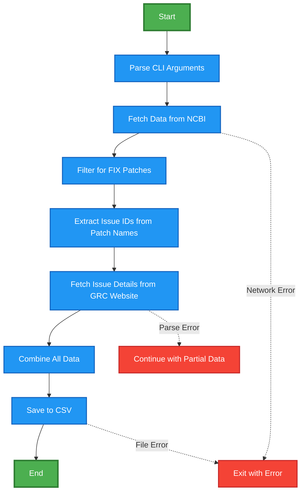

# GRC Fix Monitoring Tool 🧬

> A simple tool to track genome assembly fixes and improvements from the Genome Reference Consortium (GRC)

## What does this tool do?

The human genome reference is constantly being improved as scientists discover errors or find better sequences. When researchers find problems in the genome assembly, they report "issues" to the GRC, who then create "patches" to fix these problems.

This tool automatically:
- 📥 Downloads the latest patch information from NCBI
- 🔍 Identifies which patches are actual "fixes" (not just alternatives)
- 🏷️ Extracts the issue numbers that each patch addresses  
- 📋 Fetches detailed information about each issue from the GRC website
- 📊 Combines everything into a single, easy-to-read CSV file

### Visual flowchart


## Why is this useful?

Instead of manually browsing through multiple websites and files to understand what genome fixes are available, this tool gives you a comprehensive overview in minutes. Perfect for:

- **Researchers** who need to know about recent genome improvements
- **Bioinformaticians** tracking assembly changes for their pipelines
- **Quality control teams** monitoring genome reference updates
- **Anyone** curious about how the human genome reference evolves over time

## What you get

The tool produces a CSV file with information like:
- Which chromosome or region was fixed
- What the specific problem was (from the issue description)
- When the fix was made
- The exact genomic coordinates affected
- Current status of each issue

## Quick Start

```bash
# Install dependencies
pip install requests beautifulsoup4

# Run the tool (creates grc_fixes.csv)
python grc_fix_monitor.py

# Or specify a custom output file
python grc_fix_monitor.py -o my_genome_fixes.csv
```

## Example Output

| Patch Name | Issue ID | Summary | Status | Chromosome | 
|------------|----------|---------|---------|------------|
| HG2095_PATCH | HG-2095 | Fix assembly gap on chromosome 14 | Fixed | chr14 |
| HG2183_PATCH | HG-2183 | Correct sequence error in centromere | Resolved | chr3 |

