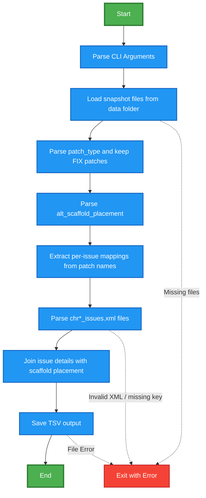

# GRC Fix Monitoring Tool 🧬

> A simple tool to track genome assembly fixes and improvements from the Genome Reference Consortium (GRC)

## What does this tool do?

The human genome reference is constantly being improved as scientists discover errors or find better sequences. When researchers find problems in the genome assembly, they report "issues" to the GRC, who then create "patches" to fix these problems.

This tool:
- 📁 Reads snapshot data from `data/YYYY-MM-DD` (from NCBI/GRC issue mapping files)
- 🔍 Identifies which patches are actual "FIX" patches (not alternatives)
- 🏷️ Extracts one or more issue IDs from each patch name
- 📋 Parses detailed issue metadata from `chr*_issues.xml` files
- 📊 Combines everything into a single, easy-to-read TSV file

### Visual flowchart


## Why is this useful?

Instead of manually browsing multiple mapping files to understand which fixes are available and what they changed, this tool gives you a consolidated view in minutes. Perfect for:

- **Researchers** who need to know about recent genome improvements
- **Bioinformaticians** tracking assembly changes for their pipelines
- **Quality control teams** monitoring genome reference updates
- **Anyone** curious about how the human genome reference evolves over time

## What you get

The tool produces a tab-delimited file (`grc_fixes.tsv`) with information like:
- Issue metadata (`issue_id`, `type`, `status`, `summary`, `description`, `resolution`)
- Version impact (`affects_version`, `fix_version`, `last_updated`)
- Patch/scaffold mapping (`alt_scaf_name`, `alt_scaf_acc`, `scaffold_type`)
- Genomic coordinates (`parent_name`, `parent_start`, `parent_stop`, `ori`)

## Quick Start

```bash
# Install dependencies (using uv)
uv sync --group dev --frozen

# Optional: download a fresh snapshot for a specific date
make download_issues_mapping_data SNAPSHOT_DATE=2026-03-06

# Run the tool (writes output/grc_fixes.tsv)
make run

# Or run directly with explicit paths
uv run python -m grc_fixes_monitor.parse_grc_fixes \
  -d data/2026-03-06 \
  -o output/grc_fixes.tsv

# Run tests
make test
```

## Example Output

| issue_id | type | status | alt_scaf_name | parent_name |
|----------|------|--------|---------------|-------------|
| HG-1342 | Path Problem | Resolved | HG1342_HG2282_PATCH | 1 |
| HG-2282 | Gap | Resolved | HG1342_HG2282_PATCH | 1 |
| HG-2095 | Variation | Resolved | HG2095_PATCH | 1 |
| HG-2058 | Clone Problem | Resolved | HG2058_PATCH | 1 |
| HG-460 | Gap | Resolved | HG460_PATCH | 1 |
